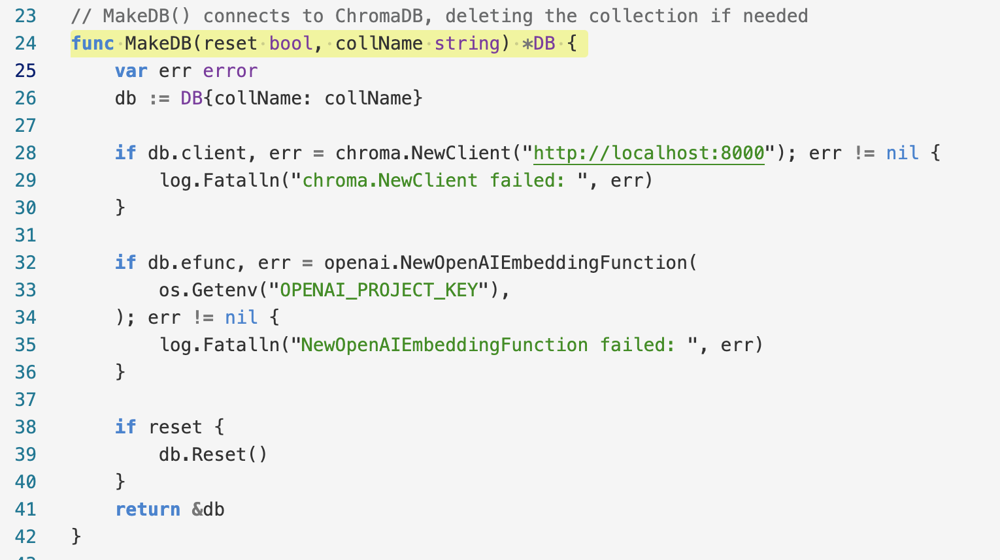

# phil-go-light README

## What's all this then?

1. I wanted a less visually-noisy color theme
1. Support for Go in the default themes is a little wonky
1. The process for figuring out the syntax and packaging mechanism for color themes is harder than I expected, so I'm making notes for future-me
1. The most helpful thing was to read the [official docs](https://code.visualstudio.com/api/working-with-extensions/publishing-extension) closely, ignoring all the search results on the web.

## Process

1. I learned about the color elements of the VS Code UI (the chrome outside the editor) from [https://themes.vscode.one/](https://themes.vscode.one/)
1. However its advice for installation was to copy the theme into `~/.vscode/extensions/`, which did not result in my color theme becoming available in VS Code
1. The names of syntax elements (inside the editor) are available using **View > Command Pallette > Developer: Inspect Editor Tokens and Scopes**
1. Color themes can be debugged live using **View > Command Palette > Start Debugging Extension Host in New Window**
1. `npm install -g yo generator-code` and `yo code` to make a starter theme and edit the various colors and syntax elements to my preference
1. `npm install -g @vscode/vsce` and `vsce package` to build the required VSIX file
1. Install the theme locally by going to Extensions, then the ellipsis menu at the upper right, then **Install from VSIX...**

